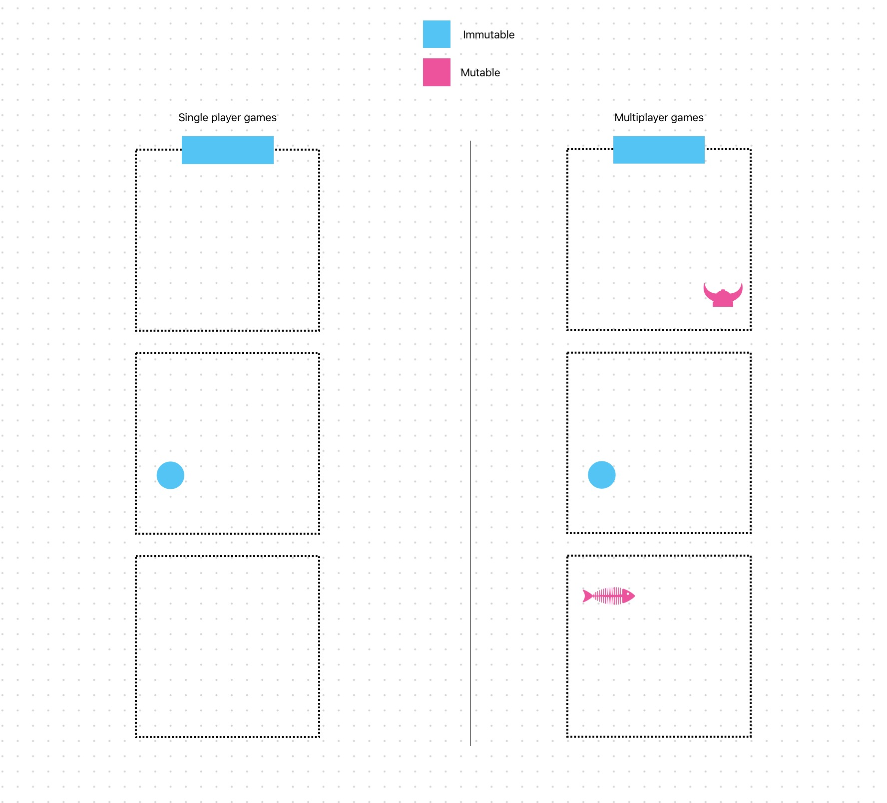
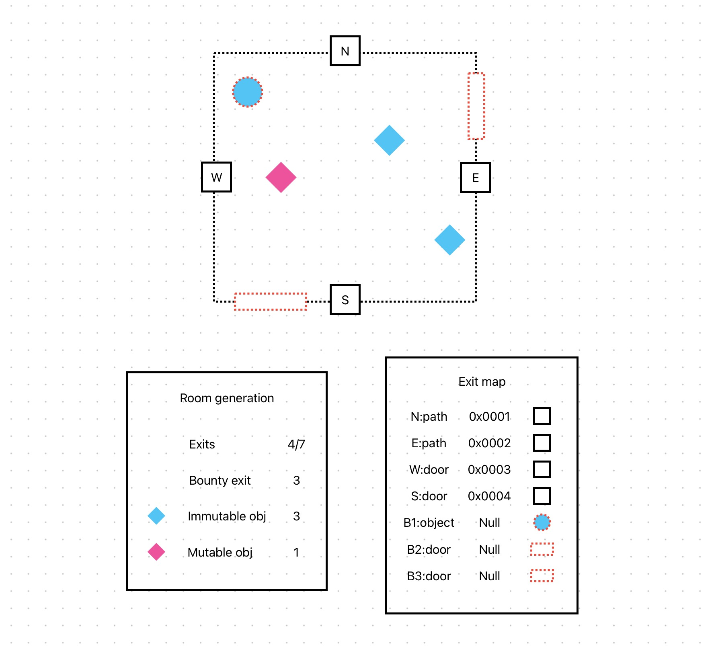

### 💸 Monetisation become the links between the rooms and their respective usage by the players
## Multiplayer | Singleplayer visualiser



Rooms can have **immutable** state in order to allow players to play through the single game adventure, progressing along the "**off chain**" storyline. These rooms will have repeatable actions and can be reset so that the player and prevent the player from getting stuck.

The **mutable** state brings about the notion of "**on chain**" whereby objects can be *taken, stolen, broken, traded* etc.

---
## Room Generation

Rooms can be authored, and upon generation immediate and future state can be described. What is exciting about future states, is that the **on chain** relationships / links / collaborations can be made in the form of **bounties**.

An example could be that there is an object in the room (described at the point of generation), and does nothing, as scripted. However a **bounty** can be placed on this object, offering a future usage or script, that can be authored via some *said* contract or mechanism. Such that through investigating, returns a *key* that can be used to unlock another puzzle in another room. This *key*  itself could also be immutable or mutable (ie there can be only one).



To get the point across the room initialisation could contain the following attributes:

```
id: r000
exits: [
	N: r001
	E: r002
	S: r003
	W: null
	B1: null  << unfulfiulled bounty
	B2: 0x321 << fulfilled bounty
]
objects: [
	{ id: o661, type: immutable, state: broken, owner: r000 }
	{ id: o662, type: mutable, state: inventory, owner: 0x888 }
]
```

The objects show **ownership** - whether they are owned by the *room* or *player*.

The example shows that an item is in the players **inventory** and owned by the player **not** the room, thus their pocket and not on the floor.


## Exploring rewards (transaction fees)


The sequence shows Player transaction fees being distributed between the three respective Authors in accordance to exploration via Room crawling and Object interaction.

Authors have been able to create their own rooms because of the available **bountable** Exits that were created by the original team.

A collaboration existed between two Authors whereby a *key* was available to be taken from one Room and used in an entirely different room to open up the Exit to draw the player into the authors respective Room.
