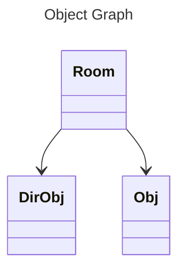
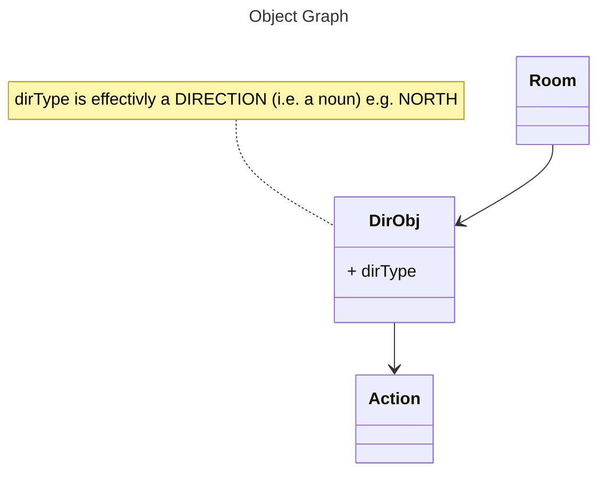
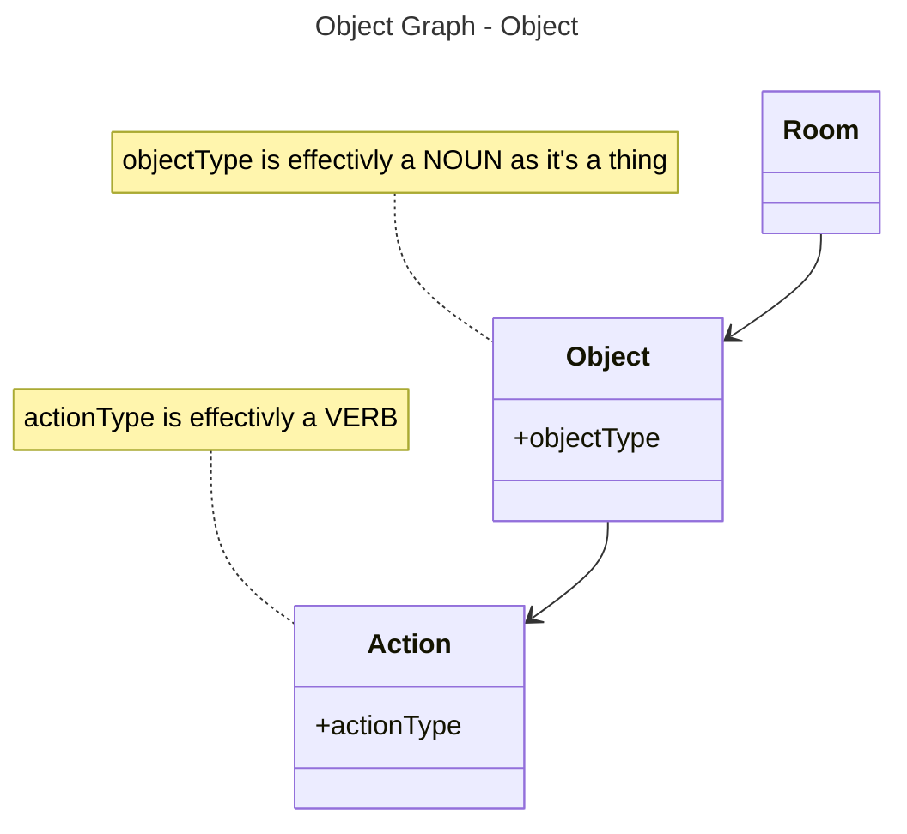
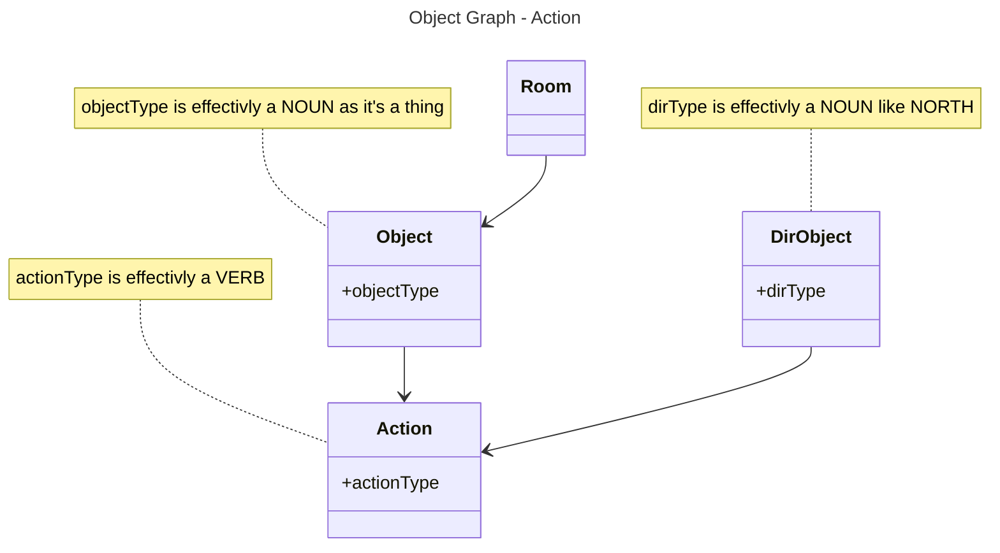
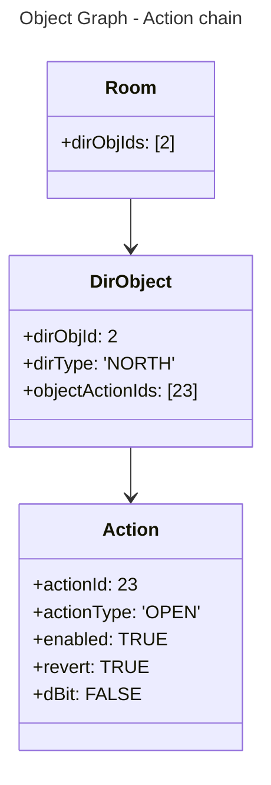
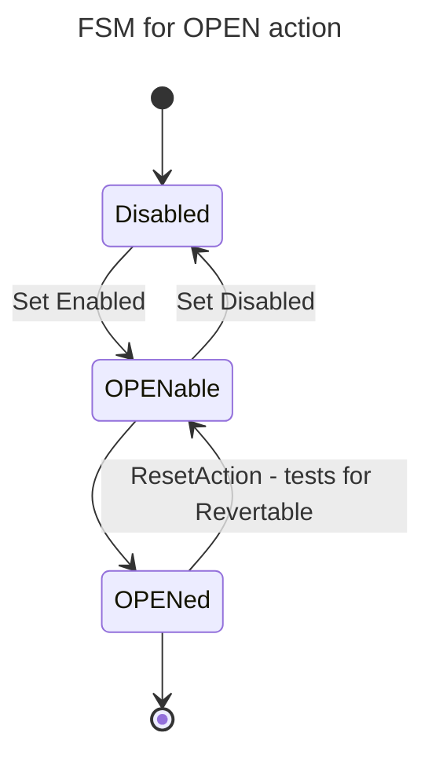

# How room's and objects work together

### how this page works:
we set out higher level descriptions of the tables we use to store data in the game as it is defined in the referenced files. this is usually under the subtitle `what is x ?`

then further down the page and where further analysis is deemed required there will be a section usually titled `how is x ?` 

then we walk through the actual process of adding a room using an existing room

finally we look at the relevant code.

## what is room ?
#room #world_config
this describes in some detail how we add a room conceptually and how this maps to the current implementations for both EthereumVM (Solidity and MUD), and CairoVM (Cairo1, Dojo) and Argus's Celestia Based sovereign rollup EVM Shards (Argus World Engine Go).

The referenced code sections should be auto linked in a build step and are not.

The general idea of engine design is covered else where but briefly, rooms are traversable (they can be one way though) and are containers that have a few properties and are kind of the roots of an object tree. They contain properties that are links to other containers/objects, its easier really though to consider them as addresses or tables etc. regardless the properties are either scalars or lists of other object/tables/addresses. I guess its more of a tree than anything else. 

This is how it looks in `MUD` which makes heavy use of tables which are themselves defined in the following  `.ts` file and then generated as contracts that are part of the MUD store contract, i.e a bunch of codegen which we should pick apart in some more detail as reference.

config file: [`packages/contracts/mud.config.ts`]

``` typescript
RoomStore: { 
            keySchema: {
                roomId: "uint32",
            },
            valueSchema: {
                roomType: "RoomType",
                txtDefId: "bytes32",
                description: "string", 
                objectIds: "uint32[32]",
                dirObjIds: "uint32[32]",
                players: "uint32[32]"
            },
        }
```

we will discuss the detail further down the page and there are comments in the code itself but for now note that we have arrays of type `uint32[32]` at a fixed size of 32 this is perhaps the wrong type but none the less each of those `uint32` is effectively a lookup key into another table/contract/object.

`dirObjIds:` refers to a `directionObject` (this get's handled by one type `Object` in the `cairo` version) this is an exit/entrance to a room and `objectIds`: is a set of references to funnily enough `objects`, really there is little difference between the behaviour of an `object` over a `directionObject` but we keep them separate for __reasons__ and we will now be all hand wavy.



## what is dirObject ?
it's a door or a trap door or a whatever thing but it goes somewhere and it has a set of `n` actions attached. this might be something like `open` or it might also have more like `burn` or `smash`  and these `actions` themselves have state which translates generically to `have i been used`, `can i be used`, `can i be reset` but more on that later.  

this is its table:
config file [`packages/contracts/mud.config.ts`]
```typescript
DirObjectStore: {
            keySchema: {
                dirObjId: "uint32",
            },
            valueSchema: {
                objType: "DirObjectType", // Door/Window/CaveMouth etc
                dirType: "DirectionType", // North, South, Up etc
                matType: "MaterialType",
                destId: "uint32",
                txtDefId: "bytes32",
                objectActionIds: "uint32[32]" // Open/Lock/Break etc
            },
        }
```

so we have it's id: `dirObjId`, used to look it up. 

Then the object itself has a `directionType` and a `destId` this is the next `room`.

Then a set of `actions` stored as an array of further object/table/address's
in fact as said all objects have a set of actions they define what it can actually do the ones that make most sense to a a `directionObject` (at least as it is currently implemented) are things like being locked, being open, being useable.



as stated before really it's an object but we handle movement in a specialised `system` (to use MUD parlance).

The rest of the properties are mainly used for the generation of descriptions that we can feed back to the user but more on this later.

Of note however is the `dirType` property, this is an enumerated value and maps to a direction type such as `NORTH`, `UP`, `SOUTH` etc.

This object/table is primarily used by the `MovementSystem` to determine if a user can actually use one of the directions/exits to a room.
see [[handling_movement]]. It is also used by the [[handling_looking]] system to generate the user output.

## what is Object 

its a thing that a user may interact with albeit is doesn't have to be useable at all. it is a thing that will be placed into a `room` and can be composed to make other things happen. this is achieved in the same manner as a `dirObj` (because as we said its basically the same) by adding `actions`.

this is its table:
config file: [`packages/contracts/mud.config.ts`]
```typescript
ObjectStore: {
            keySchema: {
                objectId: "uint32",
            },
            valueSchema: {
                objectType: "ObjectType",
                materialType: "MaterialType",
                txtDefId: "bytes32",
                objectActionIds: "uint32[32]",
                description: "string"
            },
        }
```




it also has a type property, in this case `objectType` and this is a noun as it is a "thing". e.g. a `football`. we will get to this later under `how is x?`.


### what is action ?
`action`s are `VERB`s, they are things that can be done and as such we add these to `objects` (both `object` and `dirObj`) to give the object functionality. e.g we can add a `KICK` type of action to a football.

this is an actions table:
config file [`packages/contracts/mud.config.ts`]
```typescript
ActionStore: {
            keySchema: {
                actionId: "uint32",
            },
            valueSchema: {
                actionType: "ActionType",
                dBitTxt: "bytes32", // txt when the state is flipped
                enabled: "bool", // can it be used? 
                revert: "bool",
                dBit: "bool", // is it done, LOCK->lockED 
                affectsActionId: "uint32", // follow this action chain 
                affectedByActionId: "uint32" // does this id match 
            },
        }
```



we handle this in code by assuming 3 states: 

`enabled` := `can i be used?`
`revert` := `can i be reset?`
`dBit` := `have i been used`

there are more comments in code and we will go into this further but briefly an example would be kicking a ball to break something or opening a closed door.

we also enable a chain of things, like open affects another action sort of like a linked list, we may have a "child" action and a "parent" action.

an example is kicking a ball through a window. the action of breaking the window causes the open action to be enabled and also for it to become __OPEN'ED__

we will drill more into this in the why section below [[#why is `action` actions verbs]]

## why is `dirObj` #actions #movement

it is as we have mentioned really a specialised object but we use them only in the movement handler rather than as a general action.

## why is `object` #actions #modelling

so we can chain together object graphs to create behaviour in the most generic way we can

## why is `action` #actions #verbs

considering opening a `door`. our `dirObject` is of type `door` . We add an open-ing action to the door to make it openable, this open action is identified by being an `open` type of action. 

it is `enabled` meaning it can be used and it has its `dBit` set to `0` i.e. we treat this `dBit` as a `bool` meaning in this case that the open action is enabled (__WE CAN USE THIS__ because `enabled == 1`)

_but_ the `dBit` is set to `0`, (__I HAVE NOT BEEN USED__) so we can't go through the door, because `open == 0`

to put it another way the `dBit` of the action of type `open` is `0` . Therefore the `open` has not become __OPEN'ED__ so it must therefore be closed.

when the movement handler comes to process this object it will first check for `enabled` then for the `dBit`. (it will also repeat this for the chain of objectId's from `action.affectsActionChain` which we will get to)

the `dBit` in the `door` example is `0` so the player cannot move through the door.

BUT it's revert bit is on and as such the door can be opened by setting the `dBit` to `1`. the player can do this my using a command like `open the door`.

this would then cause the action handler system to loop through the bits again which would finally end up setting the `dBit` to `1`. in other worlds the door is now __OPEN-ED__



we chain `action`'s onto `object`'s to add and compose behaviours.
