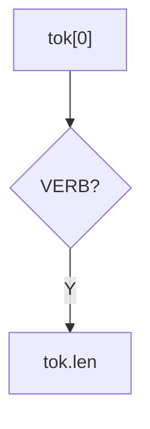

how to parse
e.g. `open large door and then go west`

simplest form would be 

```
 if: verb and valid
 	then: 
 		if: contains ADV || contains CON
 			then:
 				is combined
 		else:
 			is simple command
 end:
```

List:1 possible commands with connectives and without
open the door and go west
open the large door the go west
open large door then go west
open large blue door and go west
open the large blue door then do west
open the large door go west

we could get all "fuzzy" i guess but we dont on this iteration.

| I | Vrb  | DA  | Adj   | DirObj | Con | AdvTemp |  Vrb  | DObj | Valid |
| --- | --- | --- | --- | --- | --- | --- | --- | --- | --- |
| 1 | open | the | large | door | and | then | go | west | 8 | Y |
| 2 | open | the | large | door | and |      | go | west | 6 | Y |
| 3 | open | the | large | door |     |      |    | west | 5 | N |
| 4 | open | the |       | door | and |		 | go | west | 6 | Y |
| 5 | open | the |       | door |     | 	 | go | west | 5 | N |
| 6 | open | the |       | door |     |    	 | 	  |	west | 4 | N |
| 7 | open | 	 | large | door |     |    	 | 	  |	west | 3 | N |
Table1: Possible Combined Commands





