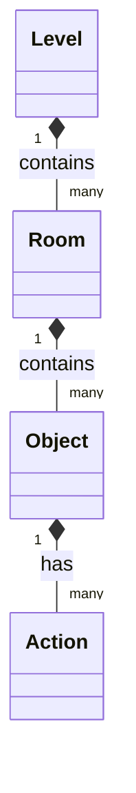

# abstract - preamble
we need some intermediate config that can be parsed to the model/object structure that can map to contracts etc.

the logic is held in a kind of object map. it approximates to



`objects` are things and as such also operate as doors/portals/exits what have you.
`actions` get chained to create complex state and behaviour. this needs to be mapped into some form of `yaml` albeit it could be JSON or toml etc.
The general structure is described in greater detail here [[what_is_a_room]]
## model structure
I think we need three conceptual items to map as a base `level`:
* rooms
* objects
* actions

and these rooms then compose into a "map"/"level"
#### room
```rust
pub struct Room{
    #[key]
    pub roomId: felt252,
    pub roomType: zrk::RoomType,
    pub txtDefId: felt252,
    pub shortTxt: ByteArray,
    pub objectIds: Array<felt252>,
    pub dirObjIds: Array<felt252>,
    pub players: Array<felt252>
}
```
#### object
```rust
pub struct Object {
    #[key]
    pub objectId: felt252,
    pub objType: zrk::ObjectType,
    pub dirType: zrk::DirectionType,
    pub destId: felt252,
    pub matType: zrk::MaterialType,
    pub objectActionIds: Array<felt252>,
    pub txtDefId: felt252
}
```
#### action
```rust
pub struct Action {
    #[key]
   pub actionId: felt252,
   pub actionType: zrk::ActionType,
   pub dBitTxt: ByteArray, // when the bit is set then output this
   pub enabled: bool,
   pub revertable: bool,
   pub dBit: bool,
   pub affectsActionId: felt252,
   pub affectedByActionId: felt252
}
```

## layout

we might layout the level as a 2d array of chars; at it's most basic
```c
'.' => emptyspace
'p' => portal
'o' => path
'r' => room
'x' => level start[s]/exit[s]

// start
// path heads east, portal south
// room with portal south
// room with portal east
// exit
[. . . x o o o .]
[. . . . p p . .]
[. . . . r p . .]
[. . . . . r . .]
[. . . . . p . .]
[. . . x p r . .]
```
we can add other chars etc.

the 2d array then gives us a coordinate for the room.

`start` is c3,r0
`exit` is c3,r4
`path` segment 0 is c4,r0
etc.

this might give us a scaffold of rooms and exits to generate a base config
that ads the rooms sequentially and also can tag each room and locate the exits in relation to the directions laid out in the "map"

---
## mapping v0.1.0

#### the "map"

```
[r p r . .]
[. . p . .]
[. . r p r]
```

this map starts (for no reason) on c2,r3
* room with:
	* path west
* room with:
	* path north
* room with:
	* path south
	* path west

that now gives a base yaml structure of the rooms in relation to each other in a coordinate space, here `column major`

```yaml
levels:
  - levelName: "a wake up call"
    rooms:
      - roomID: 1
        roomName: "wake up pass"
        roomDescription: "a high mountain pass winding through the gtaefk hills. The pass is narrow and flanked by steep sided valleys falling off to the east and the west"
        exits:
          - exitID: 1
            direction: "W"
            type: "path"
            material: "dirt"
            isOpen: true
        objects:
          - objID: 1
            type: Football
            objDescription: "a cheap shoplifted uefa football. not quite round, kickable"
            actions:
              - actionID: 1
                type: "kick"
                defaultResponse: "the balls rolls feebly away as you fluff the kick and lands in some dog shit"
      - roomID: 2
        roomName: "bensons plain"
        roomDescription: "a barren plain. The air is greasy with the taste of bensons"
        exits:
          - exitID: 1
            direction: "W"
            isOpen: true
          - exitID: 2
            direction: "N"
            isOpen: true
      - roomID: 3
        roomName: "eli's barn"
        roomDescription: "a deserted barn, covered in cobwebs and litetred with broken glass and old hay, it does not smell of hay, you would prefer it dd not smell at all"
        exits:
          - exitID: 1
            direction: "E"
            type: "window"
            material: "glass"
            isOpen: false
            changeByAction: "break"
            changeResponse: "the window shatters into a thousand pieces"
          - exitID: 2
            direction: "S"
            isOpen: true
```

